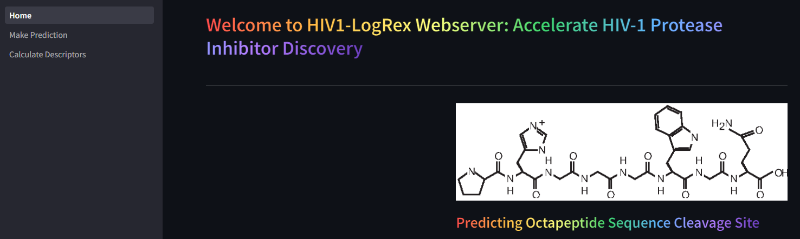

# [HIV1-LogRex](https://hiv-1-logrex.streamlit.app/): Accelerate HIV-1 Protease Inhibitor Discovery 

**[HIV1-LogRex](https://hiv-1-logrex.streamlit.app/)** is a user-friendly webserver that provides powerful tools for predicting HIV-1 protease cleavage sites, a crucial step in HIV-1 replication. Leveraging machine learning algorithms, HIV1-LogRex empowers researchers to optimize the drug discovery process for novel HIV-1 protease inhibitors. It also implements varied algorithms for octapeptide descriptors calculations (amino acid binary profile (AABP), physicochemical properties and bond composition).

## Addressing a Global Challenge:
HIV/AIDS remains a significant public health concern, particularly in developing nations. Effective therapeutic strategies are critical to combat this devastating disease. **HIV1-LogRex** directly addresses this need by facilitating the development of new drugs that target the HIV-1 virus at a fundamental level.

## How HIV1-LogRex Works:
The HIV-1 protease plays a vital role in HIV-1 replication. Accurately predicting the cleavage sites of this enzyme is essential for designing effective HIV-1 protease inhibitors. **HIV1-LogRex** offers:

- **Varied Algorithms**: Explore diverse algorithms for octapeptide descriptors calculations - amino acid binary profile (AABP), physicochemical properties and bond composition.
- **Octapeptide Descriptors**: Utilize a unique combination of sequence information incorporating bond composition, amino acid properties, and physicochemical features for comprehensive analysis.
- **Logistic Regression Model (HIV1-LogRex)**: Access a highly accurate model specifically designed for predicting the substrate specificity and cleavage site of HIV-1 protease.

## Innovation and Rigorous Evaluation:
**HIV1-LogRex distinguishes itself by:**

- **Hybrid Feature Set**: The webserver employs a novel combination of octapeptide descriptors, leading to potentially superior prediction accuracy.
	- `Amino Acid Binary Profile (AABP)`
  -	`Physicochemical properties`
  -	`Bond composition`
- **Combined Dataset**: Unlike previous studies, HIV1-LogRex leverages a comprehensive dataset for training and evaluation, ensuring robust model performance.
- **Stratified Cross-Validation**: This rigorous validation technique guarantees consistent and reliable model performance.

## Getting Started:
Visit the **HIV1-LogRex** at [https://hiv-1-logrex.streamlit.app/](https://hiv-1-logrex.streamlit.app/). The user-friendly interface allows you to effortlessly upload octapeptide sequences for analysis.

# Installation:
No installation is required.

# License: 
**HIV1-LogRex** is freely available under the MIT License, enabling open access and unrestricted use. 

# Feedback and Contribution:
We welcome your feedback and suggestions for further enhancing **HIV1-LogRex**. Feel free to reach out and share your thoughts. Additionally, if you're interested in contributing to the codebase, please don't hesitate to get in touch.

## Citation: 
**If you utilize HIV1-LogRex in your research, please cite it as follows:**

**Onah E. (2024). HIV1-LogRex (v1.0.0). Zenodo. https://doi.org/10.5281/zenodo.10851067.**